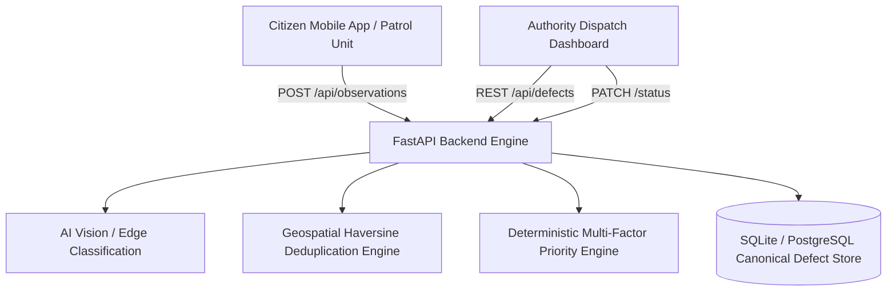

# RoadGuard AI — Road Health Intelligence Platform

An end-to-end civic intelligence system that transforms crowdsourced citizen captures into deduplicated, prioritized municipal road repair dispatch orders using AI vision and geospatial clustering.

---

## 🏛️ System Architecture



---

## 🚀 Quick Start (Running Locally)

To launch both the **FastAPI Backend** and the **Authority Web Dashboard** with a single command:

```bash
cd "/Users/dhanushaadhikesh/Projects/Road health intelligence"
./start_all.sh
```

### URLs
- **Authority Dispatch Dashboard:** [http://localhost:5173](http://localhost:5173)
- **FastAPI Interactive Docs (Swagger):** [http://127.0.0.1:8000/docs](http://127.0.0.1:8000/docs)
- **Citizen Mobile App (Expo):**
  ```bash
  cd "/Users/dhanushaadhikesh/Projects/road-health-intelligence"
  npm start
  # or press 'w' for web preview
  ```

---

## ⚡ Core Engine Highlights

### 1. Geospatial Deduplication & Centroid Averaging
- Computes Haversine distance with dynamic candidate gating ($r \le 25\text{m}$).
- Detects whether incoming reports correspond to existing physical road defects (`MERGE`), possible matches (`REVIEW`), or new hazards (`DISTINCT`).
- Dynamically recalculates the canonical centroid GPS location from all corroborating evidence points.

### 2. Multi-Factor Deterministic Priority Scoring (0–100)
- **Defect Severity (35%)**: Evaluated from AI or reporter severity (`SEVERE` = 35 pts, `HIGH` = 26.25 pts, etc.).
- **Corroborating Evidence (25%)**: Citizen confirmation saturation curve ($n \ge 5$ observations = full points).
- **AI Model Confidence (15%)**: Weighted by detection certainty.
- **Recency Decay (15%)**: Exponential half-life decay ensuring recurring / fresh defects maintain high priority.
- **Road Context (10%)**: Traffic tier / transit corridor classification.

### 3. Municipal Dispatch Dashboard (React + Leaflet + Vite)
- **City Road Health Score**: Aggregate health gauge (0–100) based on active defect density and severity.
- **Geospatial Map**: Real-time Leaflet map colored by priority tier (Critical: Red, High: Orange, Medium: Yellow, Low: Blue).
- **Triage Drawer**: Inspect defect evidence history, citizen photos, and trigger lifecycle actions (`Verify`, `Schedule Repair`, `Mark Repaired`, `Flag Recurred`).
- **Seed Demo Data**: One-click button to load realistic urban test clusters and timeline reports.

---

## 🔐 Two-Role Authentication System (Section 109)

ROADGUARD AI features strict role-based access control (RBAC) enforced both at the **FastAPI backend** (JWT token verification + role dependencies) and in the **React frontend** (role routing + UI permission gating).

### User Roles & Permissions

| Action | CITIZEN Role | ADMIN / AUTHORITY Role |
| :--- | :---: | :---: |
| Register / Login | ✅ | ✅ |
| Submit Road Defect Report | ✅ | ✅ |
| View My Reports (`/my-reports`) | ✅ | ✅ |
| View Assigned Digital Defect ID | ✅ | ✅ |
| View Nearby Road Map (Read-Only) | ✅ | ✅ |
| View Municipal Authority KPIs & Stats | ❌ (403 Forbidden) | ✅ |
| Review AI Detections (`Confirm`/`Reject`) | ❌ (403 Forbidden) | ✅ |
| Assign Repair Crews / Change Status | ❌ (403 Forbidden) | ✅ |
| Verify Repair Completed | ❌ (403 Forbidden) | ✅ |

### Development Demo Accounts (1-Click Fill)

For testing and hackathon demonstration, two pre-configured demo accounts are provided:

- **Citizen Demo Account:**
  - **Email:** `citizen@roadguard.demo`
  - **Password:** `citizen123`
  - **Role:** `CITIZEN`
- **Municipal Authority Demo Account:**
  - **Email:** `admin@roadguard.demo`
  - **Password:** `admin123`
  - **Role:** `ADMIN`
# Road_Health_Intelligence
